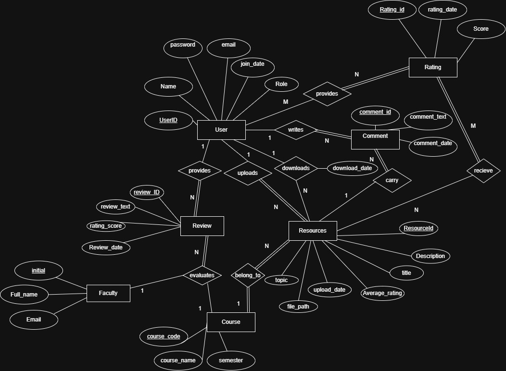
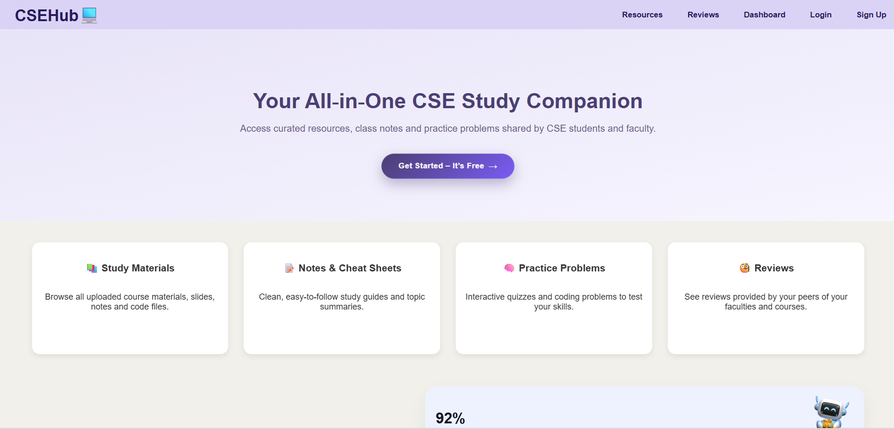
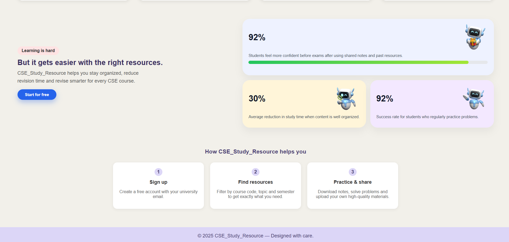
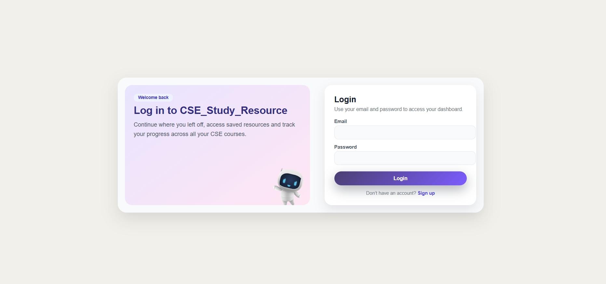
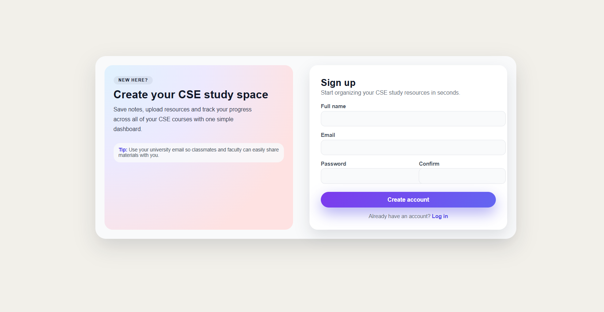
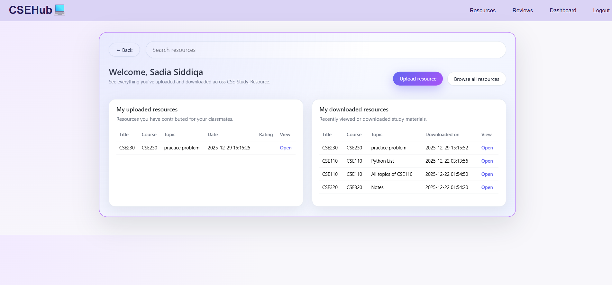
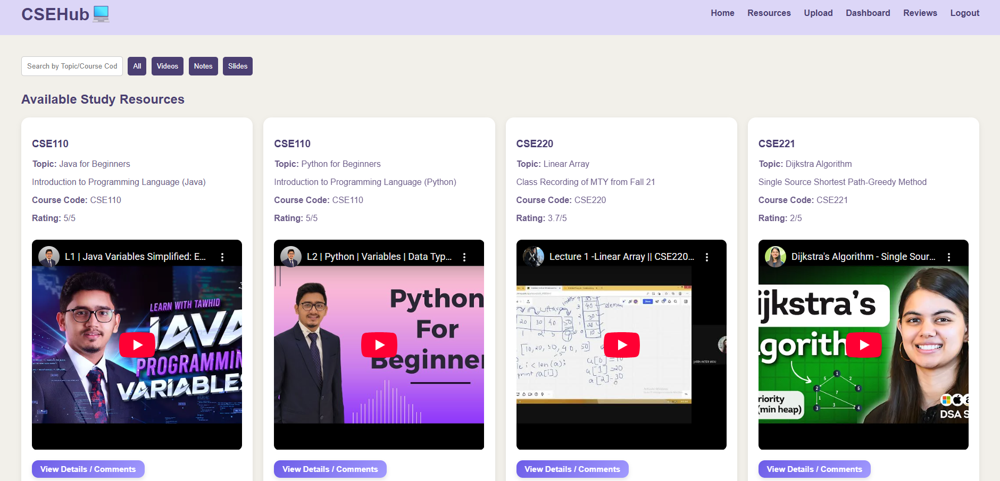
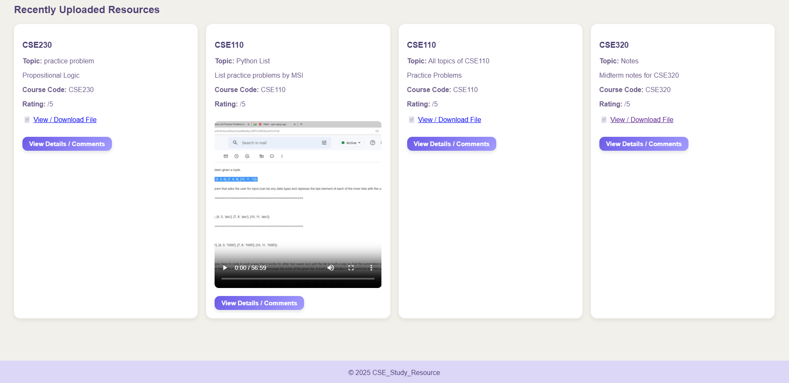
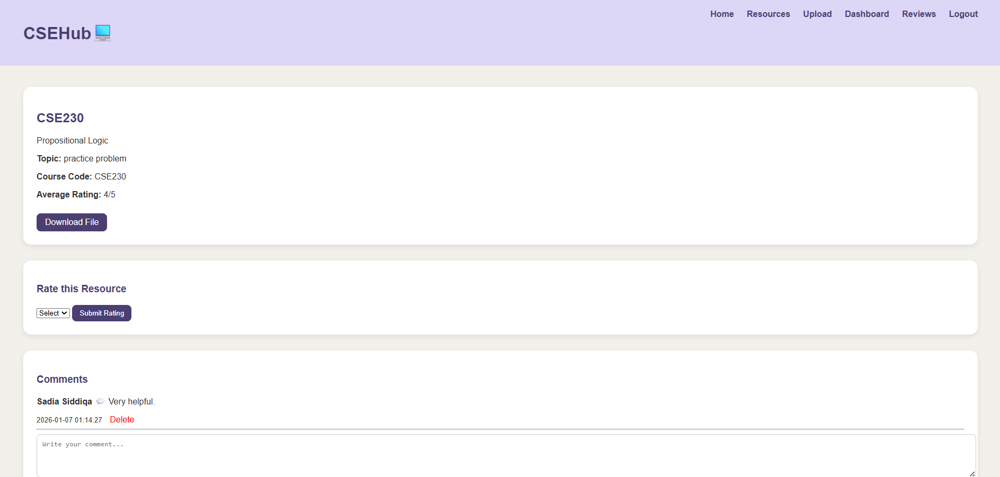
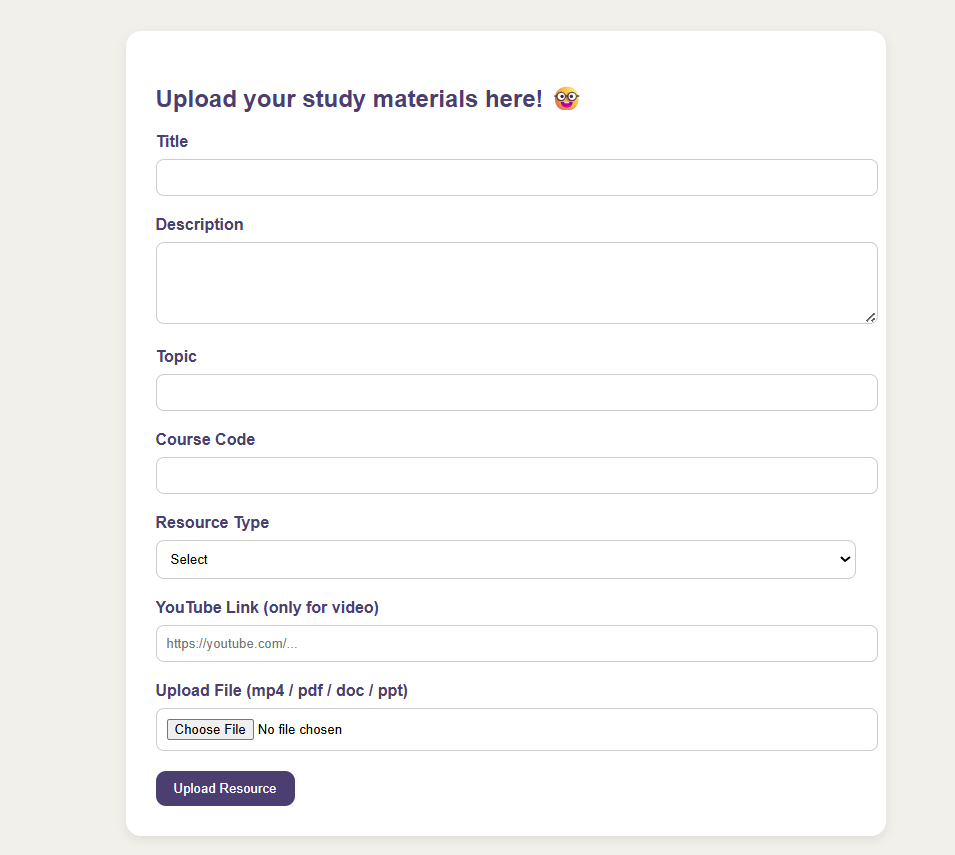

# CSEhub💻 - Study Resource Platform for Bracu CSE Students

A web-based study resource sharing platform built using **PHP, MySQL, HTML, and CSS**.

## Features
- User authentication (login/signup)
- Course and resource listing ( organize resources by semester, course code and topic)
- Upload study materials (videos, notes, slides)
- Download tracking
- Ratings & comments
- Resource search and filtering
- Dashboard for uploads and downloads
  
## Project Screenshots

### ER Diagram

### Home Page

### Login & Signup

### User Dashboard

### Resource View

### Resource Details

### Upload Page

## Technologies Used
- PHP
- MySQL
- HTML5
- CSS3
- XAMPP (Local Server)

## How to Run Locally
1. Install XAMPP
2. Clone or download this repository
3. Place it inside `htdocs`
4. Import `database.sql` into phpMyAdmin
5. Rename `config.example.php` to `config.php`
6. Start Apache & MySQL
7. Open `http://localhost/cse-study-resource`
   
## File Uploads
The `/uploads` directory is ignored in GitHub intentionally.
It will be created automatically when a user uploads a file.

> This project was developed collaboratively as part of an academic coursework.
